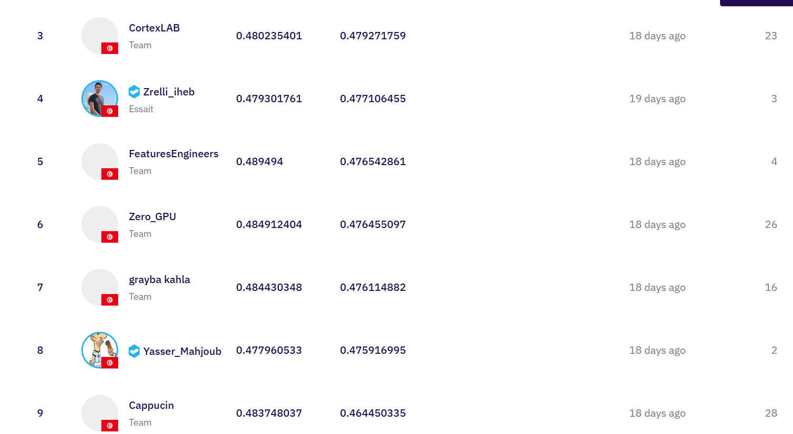

# 📶 Curriculum-Learning LLM for KPI-Based Network Error Diagnosis

[IndabaX Tunisia 2025 Challenge 2 (Zindi)](https://zindi.africa/competitions/indabax-tunisia-2025-challenge-2/leaderboard)**  
🔬 Powered by IEEE Sup’Com SB, Orange & InstaDeep  
🎯 Task: Predict improvement solutions for mobile network issues using KPI data and error labels.

---

## 🧠 Overview

This project uses a two-stage **curriculum learning** strategy to fine-tune an LLM (LLaMA 3.2B via Unsloth) to solve **network fault diagnosis** problems. The training progresses from simple error-label prompts to complex, KPI-enriched prompts.

| Stage | Prompt Type | Objective |
|-------|-------------|-----------|
| **1** | `"Explain how to solve these errors: [labels]"` | Teach general problem-solving from labels |
| **2** | `"Current KPI values — KPI1: v; KPI2: v … Explain how to solve these errors: [labels]"` | Incorporate real signal metrics for fine-grained solutions |

---

## 📁 Repo Structure

```

├── train\_stage1.py          # Stage 1 fine-tuning: labels only
├── train\_stage2.py          # Stage 2 fine-tuning: KPI-aware prompts
├── test.py                  # Final submission/inference generator
├── kpi\_mappings.pkl         # Label-to-KPI relevance map
├── final\_model/             # Checkpoint after Stage 1
├── final\_modelA/            # Checkpoint after Stage 2
└── final\_submission.csv     # Output submission file

````

---

## 📊 KPI Mapping Logic (Stage 2)

We extract the most relevant KPI columns per network error label by checking **token overlap** between KPI values and solution texts.

```python
def learn_label_feature_map(df, solution_col="improvement_solutions", label_col="network_labels", pct_threshold=0.7):
    ...
    # Compute % of times a KPI token appears in the solution per label
    pct = lab_exp.groupby('label')[feature_cols].mean().T
    label_to_feats = {
        lab: pct.index[pct[lab] >= pct_threshold].tolist()
        for lab in pct.columns
    }
    global_top = presence.sum().sort_values(ascending=False).head(5).index.tolist()
    return label_to_feats, global_top
````

KPI values are then embedded into training prompts conditionally.

---

## ⚙️ Quick Start

```bash
# Install dependencies
pip install torch transformers datasets evaluate pandas scikit-learn tqdm unsloth

# Stage 1: Simple prompt fine-tuning
python train_stage1.py

# Stage 2: KPI-aware prompt fine-tuning
python train_stage2.py

# Inference & submission
python test.py
```

---

## 🏆 Leaderboard Result

We achieved **Top 10 (9th Place)** in the final leaderboard:



> 📌 Screenshot taken from the Zindi leaderboard page.

